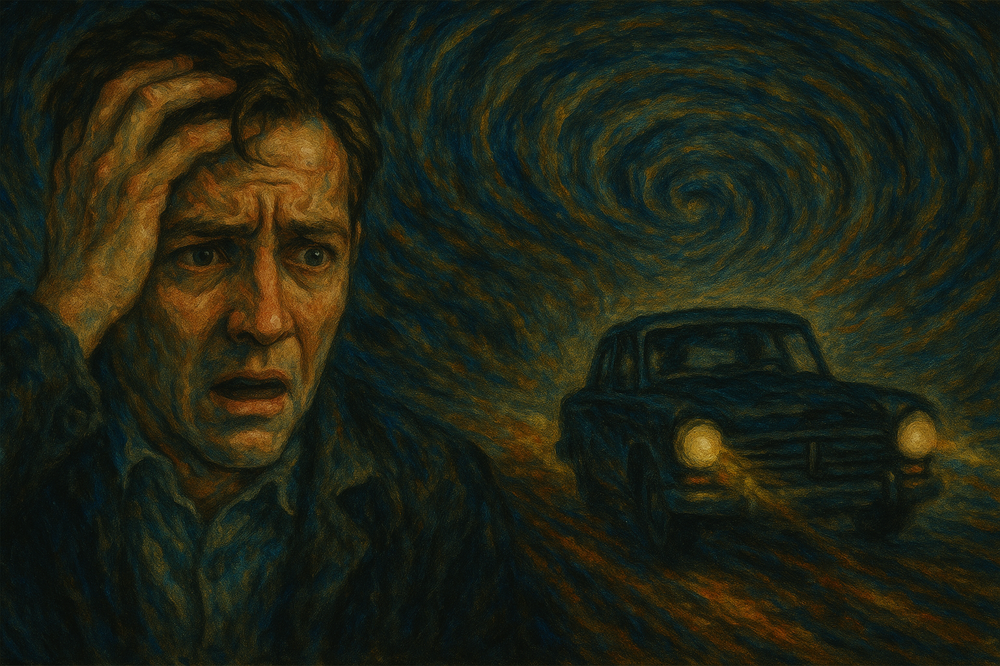

# A Beautiful Mind

This music is used during [a car chase scene](https://youtu.be/uB9Gzz3yhYY?si=yrWUg5Wto2fHtTPl) and consists of short, sharp string sounds and irregular percussive rhythms. These musical elements aurally embody the key symptoms of schizophrenia - anxiety, sensory hypersensitivity, and cognitive confusion - to immerse the audience in the protagonist's state of mind. In particular, the irregular bouncing rhythms and sharp timbres blur the line between reality and hallucination, encouraging the audience to accept the protagonist's distorted perceptions.
On the surface, it looks like an intense chase scene, but in reality, it's only happening in the hallucinations of the protagonist, who suffers from schizophrenia. Believing he's being chased by nonexistent secret agents, he runs away, an action driven not by an external threat but by internal fear, an iconic scene that visually manifests the delusions and cognitive confusion of schizophrenia. The music further amplifies this psychological pressure and confusion, and serves to trick the audience into thinking it's real.

The film is also linked to Barry Levinson's 1988 film [*Rain Man*](ahn_ire.md), which also tells the biographical story of a character with a severe neurological disorder. While schizophrenia and autism spectrum disorder are fundamentally different conditions - the former involves a disconnect from reality, while the latter is characterized by inborn cognitive differences - both films showcase protagonists who perceive the world in a different way than societal norms, and who develop remarkable insights despite their limitations. Music in particular serves as a powerful medium to convey their inner struggles, moments of epiphany, and confrontations with societal misconceptions.

