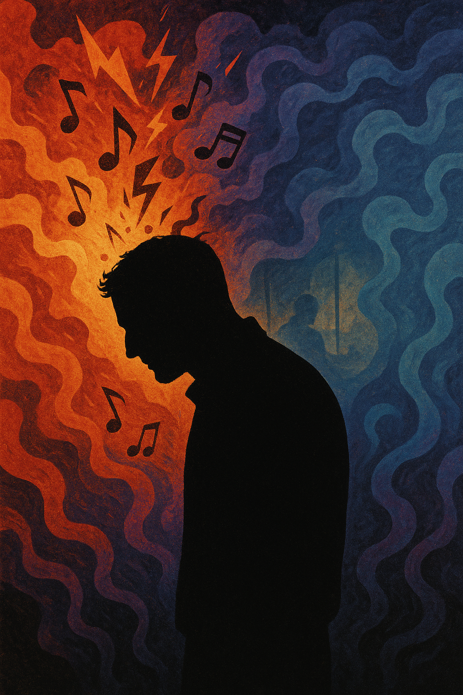

# Silver Linings Playbook

["My Cherie Amour" serves as a trigger for Pat, bringing back memories of his ex-wife.](https://www.youtube.com/watch?v=5P5d6AK8wPw) Whenever he hears the song, he impulsively erupts in anger, clearly revealing the emotional regulation difficulties characteristic of bipolar disorder. The music symbolically illustrates how a specific stimulus can have a profound and immediate impact on someone with a mental illness. Through this, the film conveys that pathological reactions are not merely a lack of rationality, but are deeply tied to emotional scars.

 The similar disease, Dysthymic disorder is described in Back sunwoo's 2024 drama [*Doctor Slump*](bae_sangjun.md). Low self-esteem and sense of helplessness, common depressive symptoms can appear in both Bipolar disorder and Dysthymic disorder. The song 'Not Alone' by HYNN is used to show protagonists' struggles and healing journeys in the drama. 

# 장례식에서 나왔으면 하는 음악

[Starship - Nothing's Gonna Stop Us Now](https://www.youtube.com/watch?v=3wxyN3z9PL4)

나는 이 노래는 가볍고, 밝으며, 굉장히 희망적이어서 장례식에 온 다른 사람들이 상황을 너무 심각하게 생각하지 않고, 장례식이 끝나고 나서도 여운을 느끼게 하되, 기분을 다운되게 하고 싶지 않아서 이 노래를 선택하게 되었다. 
평소에 나는 내 스스로를 진지하고, 비관적이라고 생각했고, 장례식에서도 나를 표현하려면 이런 부분들을 반영한 노래를 선택하는 방향으로 생각했었다. 하지만, 장례식에 오는 사람들은 나를 나름 소중하게 생각했을 사람들이고, 그런 사람들에게만큼은 장례식에서도 좋은 사람으로 남고 싶었다. 이 노래를 당연히 이곳저곳에서 들어봤지만, 최근에 영화의 크레딧에서 나오는 것을 듣고, 영화가 내용이 어땠든, 모든 게 괜찮았다는 여운을 남겼고, 듣는 와중에도 기분을 좋게 하기도 했다. 내 삶의 마지막이라는 부분에 그 크레딧을 대입했을 때, 나의 장례식에 그렇게 희망적이고, 밝은 80년대 팝 음악이 나오는 것이 약간 아이러니한 부분이 있음으로써 오히려 나를 더 잘 표현할 수 있는 것 같고, 그렇게까지 생각을 안 해도, 장례식에 온 사람들도 의미있는 시간을 갖게 해줄 수 있는 음악인 것 같다.
