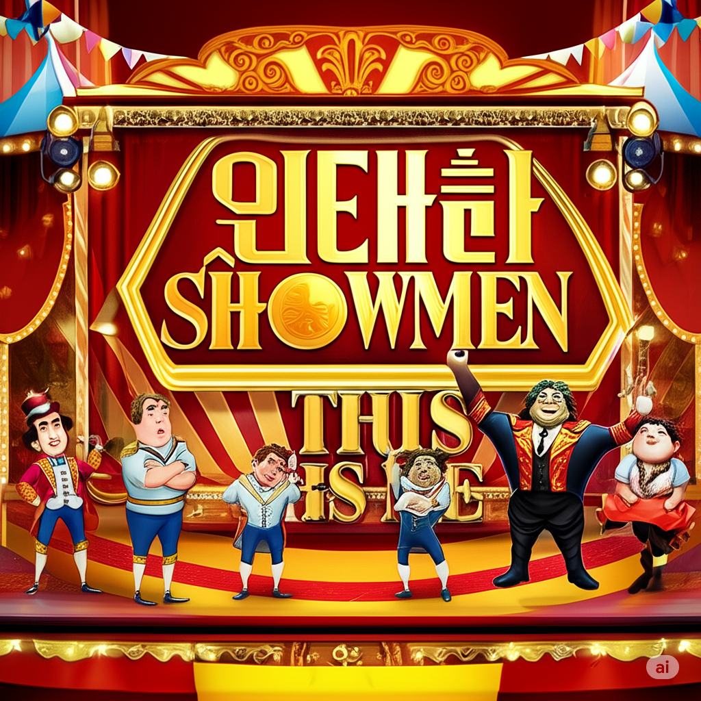

# The Greatest Showman

["This Is Me"](https://youtu.be/CjxugyZCfuw?si=BOoXxYIdEXs2kf-V) is a song used in the movie The Greatest Showman during a scene where characters with disabilities affirm and proudly express their existence. For example, Ruth Ellis, the Bearded Lady, confidently embraces her unique appearance and stands strong against prejudice. George Hussey, a dwarf, displays a bright and confident attitude, recognizing his own worth. Sung by individuals who bear social stigmas due to their appearance, identity or physical differences, the song serves as a message of liberation from social marginalization. The film effectively portrays the characters' journey of reclaiming their agency and confronting societal prejudices. Through the lyrics of the song, they reveal that they are no longer "freaks," but individuals who confidently stand on stage as human beings. For example, in the lines "When the sharpest words wanna cut me down / I'm gonna send a flood, gonna drown them out," the lyrics express a strong determination to resist hurtful criticism and overcome negativity. The next lines, "I am brave, I am bruised / I am who I'm meant to be, this is me," reflect a proud acceptance of both strength and past pain, affirming the singer’s identity with confidence and self-respect.

The depiction of the main character with a physical disability is similar to that in the movie [*To Kill a Mockingbird*](ha_jeonghyeon.md). The film's song is "Theme from to kill a mockingbird". It is also similar in that it portrays the character who is hurt by social prejudice. By contrast, To Kill a Mockingbird portrays characters like Boo Radley and Tom Robinson through the eyes of others, giving them little opportunity for self-expression. In The Greatest Showman, “This Is Me” is a declaration of self-acceptance, where marginalized characters boldly present themselves to the world. This highlights a key difference in how each story depicts responses to prejudice—active resistance versus passive endurance.

# 나의 장례식에서 연주되길 희망하는 음악

제가 장례식에서 연주되었으면 하는 곡은 영화 『드래곤 길들이기』의 OST 중 하나인 ["Test Drive"](https://youtu.be/zTSXiF_cxG8?si=7ycozdrNBSjoQGtT)입니다. 이 곡은 주인공 히컵과 드래곤 투슬리스가 처음으로 함께 하늘을 나는 장면에 사용되었는데, 저는 이 장면이 자유, 새로운 시작, 유대감을 상징한다고 생각합니다. 장례식이라는 이별의 순간에 이 곡이 흐른다면, 죽음을 단순한 끝이 아니라 또 다른 세계로 날아가는 자유로운 비행으로 표현할 수 있을 것 같았습니다. 이를 통해 저는 이 마지막 순간이 너무 슬프고 무겁기보다는, 마치 하늘을 나는 듯한 가볍고 평온한 느낌으로 기억되었으면 합니다. 또한 이 곡은 말없이 서로를 이해하고 함께 날아오르는 두 존재의 모습을 통해, 진심 어린 감정의 교류와 깊은 연결의 순간을 그려냅니다. 장례식에서 이 음악이 흐를 때, 저는 사랑하는 사람들과 나눴던 유대감을 마지막으로 한 번 더 느끼고, 전하고 싶습니다. 슬픔보다는 따뜻하고 감동적인 분위기 속에서 저를 기억해주길 바라는 마음에서, 이 곡을 선정했습니다.
