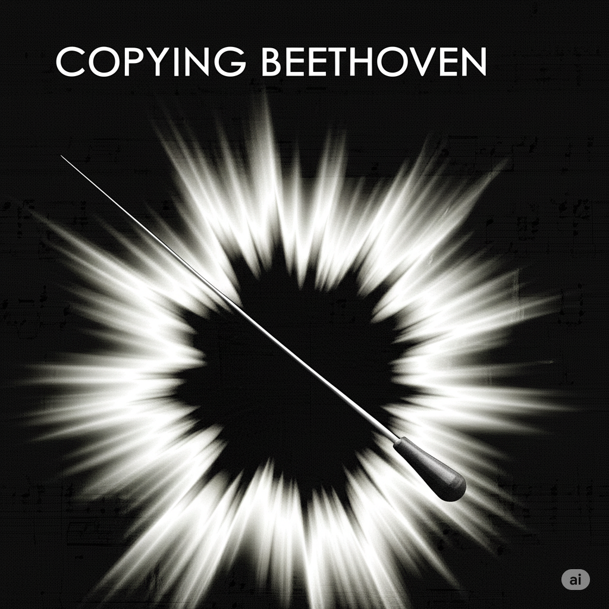

 # Copying Beethoven
 At the time of composing the [Ninth Symphony](https://www.youtube.com/watch?v=RbWmav17OEA), Beethoven was almost completely deaf.
He struggled with isolation and frustration, yet his creative spirit remained strong.
Despite his condition, he composed entirely through inner hearing and determination.​
 
 In Copying Beethoven, the film portrays the process of Beethoven composing his Ninth Symphony, particularly focusing on the inclusion of the choral finale. This symphony, known as the "Choral Symphony," is renowned for being the first to incorporate vocal soloists and a choir into a symphonic structure, a groundbreaking innovation at the time.

Both A [*Silent Voice*](Lim_seokhyeon) and Copying Beethoven center on characters who are deaf, using this condition not just as a physical trait, but as a powerful metaphor. In A Silent Voice, Shoko’s deafness symbolizes emotional isolation and the social barriers that prevent genuine connection. In Copying Beethoven, Beethoven’s deafness contrasts with the beauty of the music he creates, highlighting how inner expression can transcend physical limitation. In both stories, deafness challenges communication but also deepens it—forcing others to truly listen, not with their ears, but with empathy and understanding.

저는 제 장례식에서 F.Chopin Piano Sonata No.2 in b flat minor op.35 mov.2 가 연주되면 좋을 것 같습니다. 그 이유는 쇼팽 소나타 2번 2악장은 절제된 슬픔과 고요한 품위가 담겨 있어, 이별의 순간에 어울리는 음악이라 생각합니다. 반복되는 리듬 속에서 느껴지는 무덤덤한 진행은, 삶과 죽음을 담담히 받아들이는 제 태도를 대변합니다. 또한 이 곡은 저에게 오랜 시간 위로와 사색을 안겨준 곡이라, 마지막 순간에도 함께하고 싶습니다.

[F.Chopin Piano Sonata No.2 in b flat minor op.35 mov.2](https://www.youtube.com/watch?v=zc9n2SOdksE&list=RDzc9n2SOdksE&start_radio=1)
