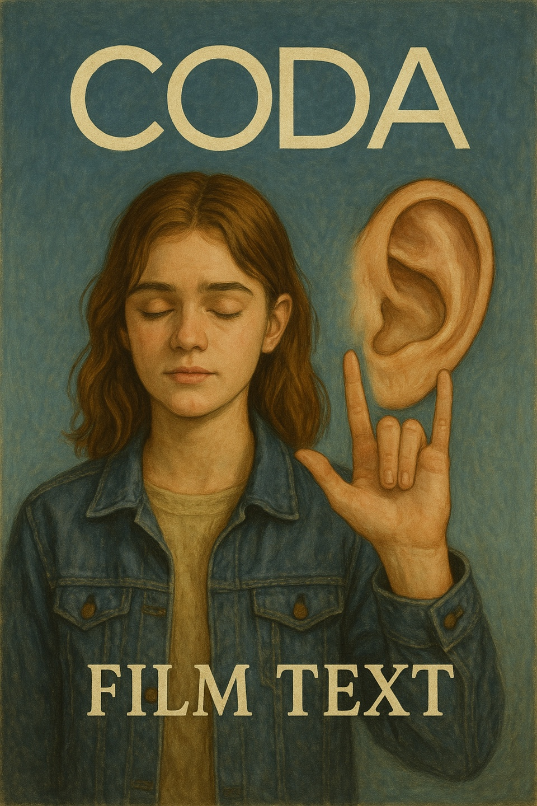

# Coda

In CODA, Ruby is torn between her deaf parents—who rely on her as their link to the hearing world—and her dream of becoming a singer. At first, she believes her path is clear. However, as time passes, she is confronted with the painful reality that she may not be able to fully embrace both her family and her future. This emotional conflict is beautifully reflected in the lyrics of "Both Sides Now." Especially the line “I really don't know life at all” conveys a deep sense of emptiness and resignation, effectively capturing Ruby's growing confusion and emotional turmoil. Her simple and confident worldview begins to unravel, gradually giving way to complex feelings of guilt, fear, and longing. The gentle rise and fall of the melody, along with Ruby's restrained yet deeply emotional vocal delivery, enhance the vulnerability in this moment. Her voice doesn’t just sing—it trembles with doubt, yearning, and love, subtly mirroring her internal struggle. If the lyrics had also directly addressed her unique situation—being the only hearing member in a tight-knit deaf family—it might have deepened the emotional resonance. Nonetheless, the music’s tender atmosphere evokes images of isolation, open skies, and unspoken bonds—visual metaphors for Ruby’s inner world that allow the audience to feel the tension between silence and sound, duty and desire. [the scene where the song play](https://www.youtube.com/watch?v=SgKvP0O0nyI)

Example: A movie similar to CODA is Sound of Metal (2019).Both films center around deafness and explore themes of identity and community through the experience of losing or living without sound. They also share a commitment to authentic representation, including casting deaf actors in key roles.

Westlife의 "My Love"는 사랑하는 사람과의 이별 후, 그리움과 추억을 간직한 채 다시 그 시절로 돌아가고 싶다는 마음을 담고 있는 곡입니다. 부드러운 멜로디와 절제된 감정 표현은 장례식이라는 엄숙한 순간에 조용한 위로를 전하며, 고인을 추억하는 이들의 감정을 자연스럽게 끌어올립니다. 단순한 슬픔을 넘어서, 삶의 소중한 순간들과 사랑의 기억을 되새기게 하는 이 곡은 고인을 향한 애도와 감사의 마음을 진정성 있게 표현하기에 적절하다고 생각합니다. [My Love](https://www.youtube.com/watch?v=ulOb9gIGGd0&list=RDulOb9gIGGd0&start_radio=1)
