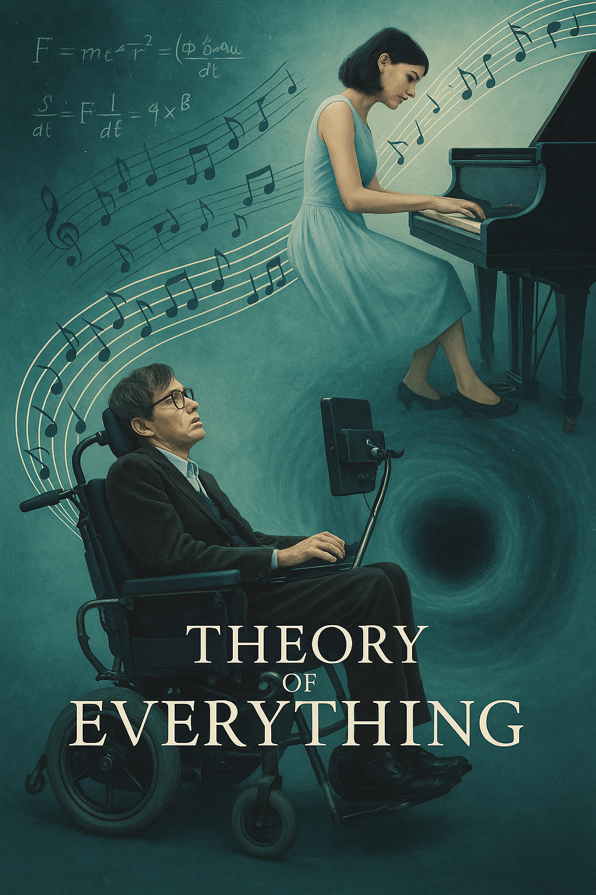

# The Theory of Everything

The music in "The Theory of Everything" （2014,James Marsh) plays a core role in emotional driving and narrative supplement throughout the film. It is not only the background, but also an important force in promoting the plot, deepening the character's psychology and echoing the theme.

Composer Jóhann Jóhannsson uses gentle piano and progressive strings to create an atmosphere of romance, depression, hope, or sadness in different scenes. For example, the soundtrack at the beginning of love is brisk and warm, reflecting the innocence and hope between Hawking and Jane. When the disease is diagnosed and worsens, the music turns low and slow, expressing inner fear and the heaviness of life. [The most impressive scene is](https://www.youtube.com/watch?v=pZ3b1a2OnhQ)  the final speech and footage of the camera rewinding to relive life are paired with the theme song, which generates strong emotional release and philosophical resonance.

The music I want to play at my funeral is [WE ARE THE WORLD](https://www.youtube.com/watch?v=s3wNuru4U0I).I chose to play "We Are the World" at the funeral because it not only conveys the power of unity and hope, but also symbolizes a love that transcends life and death. As the lyrics say, each of us has the power to make the world a better place. The melody and lyrics of this song are full of warmth, and many people have deep feelings for this song.
