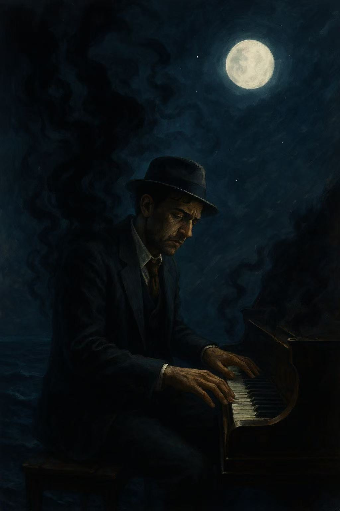

# The Legend of 1900

The Legend of 1900 (1998) is a film directed by Giuseppe Tornatore, depicting the life of a genius pianist named “1900”, who was born on a ship and never once set foot on land. The protagonist suffers from severe Social Anxiety Disorder, feeling extreme fear at the thought of leaving the ship. Through his unique life story, the film delicately portrays the loneliness and anxiety of human existence.

[In one of the film's most memorable scenes](https://m.youtube.com/watch?v=F0OR-93eKcw) The film metaphorically expresses Social Anxiety Disorder through the character 1900, who, out of fear of the outside world and social interaction, chooses to live his entire life on the ship. Rather than explaining through dialogue, the film subtly and emotionally conveys his inner anxiety and isolation through his actions, expressions, and the music.

Example：The same disease is described in Mamoru Hosoda's 2021 film [*The Dragon and the Freckled Princess*](huh_yejin.md) The film Belle's hit song ＂A Milloin Miles Away.＂

# 장례식장에서 연주하고 싶은 음악:"倍儿爽(베이얼쌍)"

이 노래는 중국에서 매우 인기 있는 곡으로, 파티나 즐거운 자리에서 자주 재생됩니다. 하지만 저는 이 노래, [倍儿爽(베이얼쌍)](https://m.youtube.com/watch?v=U39QKFdPVZk)  을 제 장례식에서 틀고 싶습니다. 이 노래 제목의 의미는 “매우 상쾌하다”, 즉 “정말 기분이 좋다”는 뜻입니다. 이 곡은 경쾌한 리듬을 가지고 있으며, 동시에 낙천적이고 유쾌한 삶의 태도를 잘 전달해 줍니다. 제가 이 노래를 선택한 이유는, 사람들이 저를 떠올릴 때 단지 슬픔만 느끼는 것이 아니라, 제가 남겼던 즐거움과 가벼운 웃음도 함께 기억해 주셨으면 하기 때문입니다. 인생은 이미 충분히 고되고 힘든 것이기에, 장례식까지 너무 무겁지 않았으면 합니다. 저의 이별이 따뜻하고 힘이 되는 하나의 메시지가 되기를 바랍니다: 살아 있는 매 순간을 가능한 한 ‘매우 상쾌하게(非常爽)’ 살아가야 한다는 것을요.
